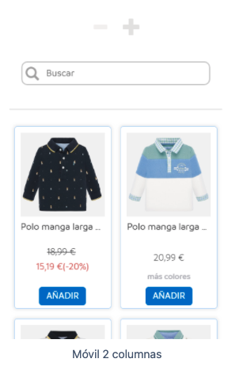

# Mayoral Frontend Assignment

|              Desktop              |             Mobile              |
| :-------------------------------: | :-----------------------------: |
|  |  |

Maquetar las imágenes adjuntas y tener en cuenta los diferentes cortes en móvil y escritorio. La prueba deberá estar subida en un repositorio de GitHub.

Tecnologías/Librerías requeridas:

- React
- Typescript
- Next.js

Funcionalidad a implementar:

- Separa en componentes de una forma óptima y organizada
- La vista debe asemejarse lo más parecido posible a las fotos adjuntas
- Implementar búsqueda de productos por nombre
- Consumir un JSON con los datos de productos (JSON local o externo)
- Cambiar la vista con los iconos indicados en la foto:
  - Escritorio de 4 a 3 elementos
  - Móvil de 3 a 2 elementos
- Implementar lógica y diseño de un componente “ordenar” (precio ascendente y descendente)
- Crea los test unitarios que creas conveniente

COMENTARIOS:

- Búsqueda de productos "as-you-type", no es necesario dar al enter o click al icono.
- Los datos consumidos están en un archivo .ts para que contenga también la definición del tipo; pero los datos son convertidos a json en el momento de enviarse.
- La vista cambia entre 4-5 elementos (desktop) y 1-2 elementos (mobile) para mejorar la experiencia de usuario.
- Los test unitarios están integrados en los end-to-end. Para ejecutarlos hay que abrir dos consolas: en la primera correr npm/yarn dev y en la segunda npm/yarn test.
- Tecnologías aprendidas "on-the-fly" durante esta prueba:
  - Next (no se especificó como requerimiento en la oferta de empleo)
  - Playwright
